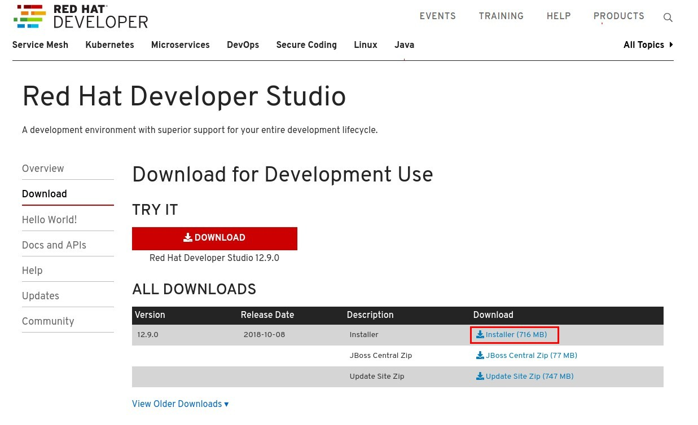
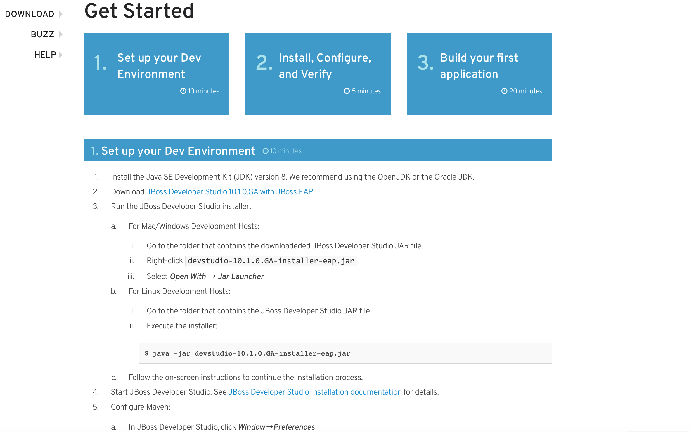

= Agile Integration Advanced LAB 1- Environment Set up Lab

In this lab, you set up the environment for the labs in this course.

[type=walkthroughResource,serviceName=openshift]
.OpenShift
****
* link:{openshift-host}[Openshift Console, window="_blank"]
****

[type=walkthroughResource]
.Integreatly
****
* link:https://github.com/integr8ly[Integreatly, window="_blank"]

****

[time=10]
== Introduction

In this lab, you set up the environment for the labs in this course. You will install required software and download lab assets in the local environment. On OpenShift, a shared namespace {user-sanitized-username}-fuse is created and common services like AMQ Broker and PostgreSQL are deployed in this namespace. This namespace is used across the Fuse and Fuse Online labs for developing the usecases.

=== Goals

* Set up the developer tools on your desktop
* Authenticate the OpenShift client with the OpenShift Container Platform master API
* Install and use the OpenShift command line interface (CLI)

=== Prerequisites

* An open broadband Internet connection
* A terminal client, such as PuTTy for Microsoft Windows
* A current browser, such as Google Chrome or Mozilla Firefox
* OPENTLC credentials
* Enough disk space to install Red Hat CodeReady Studio, Red Hat Fuse, Red Hat AMQ and other programming tools (Maven, OpenShift CLI, Java).
+
[IMPORTANT]
Make sure that the Internet connection is free of corporate proxies or other network rules that prevent access to remote servers on the Internet.

[time=60]
== Install on Local Workstation

In this course, you create Red Hat Fuse Standalone and Fuse on OpenShift applications, using Red Hat JBoss CodeReady Studio and OpenShift CLI tools on the desktop, and deploy them to an OpenShift project. Hence, the required software below needs to be installed on your local workstation.

=== Required Developer Tools

Verify that the following software is installed on your machine. If not, follow the links to install the required software:

. JDK 1.8
. Maven 3.3.9+
. Git
. OpenShift CLI 3.11
. SoapUI (Optional)

[type=verification]
Are all the required developer tools available in your local workstation?

[type=verificationFail]
Please follow the links on the right to download and install the required software tools before proceeding to next section.

=== Download Lab Assets to workstation

This course comes with a variety of lab assets that are version-controlled in GitHub. In this section, you clone or update the lab assets on your workstation so that they are available locally for use in the course labs.

. In a terminal shell, create a directory called `ai_advanced_labs` and change your working directory to it:
+
[source,sh]
----
$ mkdir ai_advanced_labs
$ cd ai_advanced_labs
----

. From this new directory, download the lab assets from GitHub and change your working directory to `agile_integration_advanced_labs/code`:
+
[source,sh]
----
$ git clone https://github.com/gpe-mw-training/agile_integration_advanced_labs.git
$ cd agile_integration_advanced_labs/code
----
+
[NOTE]
This is the root folder for the lab assets. The absolute path to this folder is referred to as `$AI_EXERCISE_HOME` in the instructions.

=== Install Red Hat CodeReady Studio

. Using your browser, navigate to the product page for link:https://developers.redhat.com/products/codeready-studio/[Red Hat CodeReady Studio].

. On the left side, click *Download*.
* Note that the latest release of Red Hat CodeReady Studio is highlighted near the top of the page.

. Click *Installer* to download the installer for the latest version of Red Hat CodeReady Studio:
+

. Proceed to log in.
* The download begins shortly after you log in.

. Follow the onscreen instructions to install Red Hat CodeReady Studio, substituting the name of the JAR file with the one you downloaded:
+

Red Hat CodeReady Studio includes a variety of plug-ins for Eclipse. You use the following Red Hat CodeReady Studio plug-ins to complete the labs in the Red Hat OPEN middleware courses:

* *Integration Stack*: The Integration Stack suite of plug-ins is particularly important when using Red Hat(R) Fuse and Red Hat(R) AMQ. The Integration Stack is not included with Red Hat CodeReady Studio and must be manually installed.

* *EGit*: CodeReady Studio includes the Eclipse EGit plug-in, which provides Git project support. No additional installation is required. Git is an open source version control system, providing developers with fast, versatile access to their application code's entire revision history.

* *M2E*: Red Hat CodeReady Studio includes the Eclipse M2E plug-in, which provides support for Apache Maven projects. No additional installation is required. The M2E plug-in enables you to edit a Maven project’s `pom.xml` and run a Maven build from the IDE.

You can select the plug-in installation during the Red Hat CodeReady Studio installation process, or you can select these from the welcome page.

[type=verification]
Is Red Hat CodeReady Studio installed successfully on your local workstation?

[type=verificationFail]
Please follow the links on the right to download and install Red Hat CodeReady Studio before proceeding to next section.

=== Install Red Hat Fuse 7.2.0 (Optional)

If you want to deploy and run the labs locally, you will need to install Red Hat Fuse on your laptop. Please download the Red Hat Fuse install from link:https://developers.redhat.com/products/fuse/download/[Red Hat Fuse Download] and follow the installation steps.

NOTE: Note that the skeleton code for the labs is provided as a Spring Boot application, so you can choose to test the labs locally using the spring-boot Maven plug-in, or from Red Hat CodeReady Studio. Optionally, you can install either standalone Red Hat Fuse Karaf or JBoss EAP depending on your preference, and deploy the labs to these standalone environments. As part of the labs, you will also be deploying the labs to an OpenShift Container Platform environment.

=== Install Red Hat AMQ 7.2.0

You need to run a Red Hat AMQ broker locally to execute some of the labs in this course. Please download the link:https://developers.redhat.com/products/amq/download/[Red Hat AMQ 7.2.0 Broker installer] and follow the link:https://access.redhat.com/documentation/en-us/red_hat_amq/7.2/html/using_amq_broker/installation[instructions] to install it on your laptop.

Once installed, please follow the link:https://access.redhat.com/documentation/en-us/red_hat_amq/7.2/html/using_amq_broker/getting_started[Getting Started] steps to start a new broker running locally on your laptop.

IMPORTANT: Provide the user ID and password for the broker as `admin` and `password`.

[type=verification]
Is Red Hat AMQ 7.2.0 installed successfully on your local workstation?

[type=verificationFail]
Please follow the links on the right to download and install Red Hat AMQ 7.2.0 before proceeding to next section.

[type=taskResource]
.Required Software
****

* link:http://www.oracle.com/technetwork/java/javase/downloads/index.html[Java SE(version 1.8), window="_blank"]
* link:http://maven.apache.org[Apache Maven(version 3.3.9+), window="_blank"]
* link:https://git-scm.com/downloads[Git(latest version), window="_blank"]
* link:https://access.redhat.com/downloads/content/290/ver=3.9/rhel---7/3.9.25/x86_64/product-software[OpenShift CLI client(version 3.11), window="_blank"]
* link:https://www.soapui.org/downloads/soapui.html[SoapUI(latest version), window="_blank"]
* link:https://access.redhat.com/documentation/en-us/red_hat_developer_studio/12.9/[Red Hat CodeReady Studio Product Documentation, window="_blank"]
* link:https://developers.redhat.com/products/fuse/download/[Red Hat Fuse Download, window="_blank"]
* link:https://developers.redhat.com/products/amq/download/[Red Hat AMQ 7.2.0 Broker installer, window="_blank"]
* link:https://access.redhat.com/documentation/en-us/red_hat_amq/7.2/html/using_amq_broker/installation[Red Hat AMQ 7.2.0 Installation instructions, window="_blank"]
* link:https://access.redhat.com/documentation/en-us/red_hat_amq/7.2/html/using_amq_broker/getting_started[Red Hat AMQ 7.2.0 Getting Started, window="_blank"]

****

[time=60]
== OpenShift Setup

A shared Integreatly OpenShift cluster is provisioned for use during the class. You can login using the credentials below:

==== Credentials

* Your OpenShift Host URL is `{openshift-host}`.
* Your username is `{user-sanitized-username}`.
* Your password is `openshift`.

=== Create OpenShift Namespace

. Login to the link:{openshift-host}[OpenShift Master, window="_blank"] using the credentials above.
. Copy the login command from the browser and use it to login from a terminal.
. Use the following command to create a new namespace:
+
[subs="attributes"]
----
oc new-project {user-sanitized-username}-fuse

----

[type=verification]
Is the new namespace in OpenShift created successfully?

=== Deploy AMQ Broker on OpenShift Container Platform

We need to deploy AMQ 7 broker on OpenShift Container Platform. The general installation steps are documented here: link:https://access.redhat.com/documentation/en-us/red_hat_amq/7.2/html-single/deploying_amq_broker_on_openshift_container_platform/[AMQ Installation of OpenShift Guide].

. Continue using the terminal where you logged into OpenShift using the `oc` command tool.
. Switch OpenShift project:
+
[subs="attributes"]
----
oc project {user-sanitized-username}-fuse
----

. Create the service account `amq-service-account`:
+
[subs="attributes"]
----
echo '{"kind": "ServiceAccount", "apiVersion": "v1", "metadata": {"name": "amq-service-account"}}' | oc create -f -
----

. Provide `view` role to `amq-service-account`:
+
[subs="attributes"]
----
oc policy add-role-to-user view system:serviceaccount:{user-sanitized-username}-fuse:amq-service-account
----

. Deploy the broker:
+
[subs="attributes"]
----
oc new-app --namespace {user-sanitized-username}-fuse \
   --template=amq-broker-72-basic \
   -e AMQ_PROTOCOL=openwire,amqp,stomp,mqtt,hornetq \
   -e AMQ_USER=admin \
   -e AMQ_PASSWORD=password \
   -e AMQ_ROLE=admin
----

. Check that the broker pod is running.
. Make a note of the console URL by running the following command:
+
[subs="attributes]
----
echo http://`oc get route console -o template --template {{.spec.host}}`
----

. Navigate to the console URL in a browser.
. Login to console using credentials `admin` and `password`.
. The broker service url for AMQP would be `broker-amq-amqp:5672`. Make a note of this when configuring the AMQ connection for the labs.

[type=verification]
Is Red Hat AMQ 7.2.0 installed successfully on OpenShift?

[type=verificationFail]
Please follow the links on the right to follow the installation steps for Red Hat AMQ 7.2.0 on OpenShift before proceeding to next section.

=== Deploy PostgreSQL on OpenShift Container Platform

We need to deploy PostgreSQL database on OpenShift Container Platform. The general installation steps are documented here: link:https://docs.openshift.com/container-platform/3.10/using_images/db_images/postgresql.html[PostgreSQL on OpenShift guide].

. In the terminal, log in to the OpenShift Container Platform cluster.
. Switch OpenShift project:
+
[subs="attributes"]
----
oc project {user-sanitized-username}-fuse
----

. Deploy the database:
+
[subs="attributes"]
----
oc new-app --namespace {user-sanitized-username}-fuse \
    -e POSTGRESQL_USER=postgres \
    -e POSTGRESQL_PASSWORD=postgres \
    -e POSTGRESQL_DATABASE=sampledb \
    postgresql-persistent
----

. Check that the database pod is running.
. Identify the name of the pod running PostgreSQL:
+
----
oc get pods | grep postgresql
----

. Note the pod name, and open a remote shell to the pod:
+
----
oc rsh <pod>
----

. You should see a shell prompt as below:
+
----
sh-4.2$
----

. Create the `sampledb` database:
+
----
createdb -h localhost -p 5432 -U postgres sampledb
----

. Log in to PostgreSQL:
+
----
PGPASSWORD=$POSTGRESQL_PASSWORD psql -h postgresql $POSTGRESQL_DATABASE $POSTGRESQL_USER

----

. You should see a database prompt as follows:
+
----
psql (9.6.10)
Type "help" for help.

sampledb=#

----

. Create the tables. Run the following commands on the PostgreSQL command line:
+
----
CREATE SCHEMA USECASE;
CREATE TABLE USECASE.T_ACCOUNT (
    id  SERIAL PRIMARY KEY,
    CLIENT_ID integer,
    SALES_CONTACT VARCHAR(30),
    COMPANY_NAME VARCHAR(50),
    COMPANY_GEO CHAR(20) ,
    COMPANY_ACTIVE BOOLEAN,
    CONTACT_FIRST_NAME VARCHAR(35),
    CONTACT_LAST_NAME VARCHAR(35),
    CONTACT_ADDRESS VARCHAR(255),
    CONTACT_CITY VARCHAR(40),
    CONTACT_STATE VARCHAR(40),
    CONTACT_ZIP VARCHAR(10),
    CONTACT_EMAIL VARCHAR(60),
    CONTACT_PHONE VARCHAR(35),
    CREATION_DATE TIMESTAMP,
    CREATION_USER VARCHAR(255)
);
CREATE TABLE USECASE.T_ERROR (
    ID SERIAL PRIMARY KEY,
    ERROR_CODE VARCHAR(4) NOT NULL,
    ERROR_MESSAGE VARCHAR(255),
    MESSAGE VARCHAR(512),
    STATUS CHAR(6)
);
----

. You can use `\q` to exit the PostgreSQL command line.

[type=verification]
Is PostgreSQL installed successfully on OpenShift?

[type=verificationFail]
Please follow the links on the right to follow the installation steps for PostgreSQL on OpenShift before proceeding to next section.

[type=taskResource]
.Red Hat OpenShift Documentation
****

* link:https://access.redhat.com/documentation/en-us/red_hat_amq/7.2/html-single/deploying_amq_broker_on_openshift_container_platform/[AMQ Installation of OpenShift Guide, window="_blank"]
* link:https://docs.openshift.com/container-platform/3.10/using_images/db_images/postgresql.html[PostgreSQL on OpenShift guide, window="_blank"]

****
