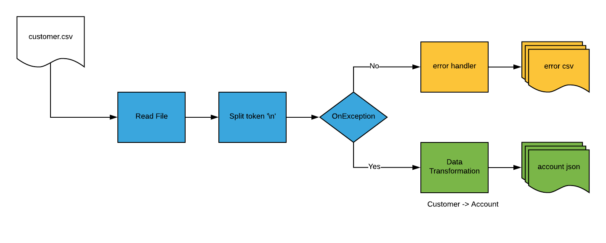
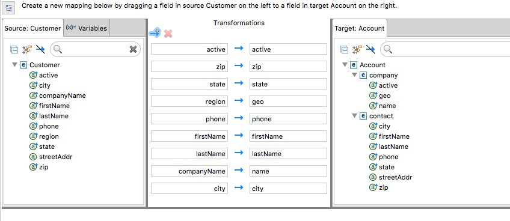

= Agile Integration Advanced LAB 2- Fuse Split and Transform Files Lab

A lab based on Springboot Camel to consume CSV records from a file, split and transform to individual JSON output files.

[type=walkthroughResource,serviceName=openshift]
.OpenShift
****
* link:{openshift-host}[Openshift Console, window="_blank"]
****

[type=walkthroughResource]
.Useful Resources
****
* link:https://google.com[Helpful link, window="_blank"]
* link:https://access.redhat.com/documentation/en-us/red_hat_fuse/7.2/html-single/tooling_user_guide/index[Red Hat Fuse Tooling Guide, window="_blank"]
****

[time=10]
== Introduction and Set up

In this lab, you develop Camel routes that process CSV files, split them into individual records, and transform them into Java objects that are output as individual JSON files. The transformation is done using the Red Hat Fuse Integration Editor. You also develop exception handling logic to process incorrectly formatted records.

=== Goals

* Build an Apache Camel route that consumes CSV files and transforms the records into Java objects using the Bindy transformation component
* Split the list of received Java objects and apply a Java-to-Java transformation using the Red Hat Fuse Integration Editor (from `org.acme.Customer` to `org.globex.Account`)
* Map the fields as defined within the table
* Transform the `org.globex.Account` Java objects into individual JSON files
* Implement the DLQ pattern to move erroneous CSV records into an error folder
* Design a unit test to validate the data transformations

=== Usecase Diagram

=== Import the Project into Red Hat Developer Studio

. Open *Red Hat Developer Studio*.
.. Select *File -> Import* from the menu.
.. Select *Maven -> Existing Maven Projects* and click *Next*.
.. Click *Browse*, navigate to the directory containing the *file-split-and-transform* project, and click *Open*.
.. In *Projects*, make sure the */pom.xml* box is checked for `com.redhat.gpte.training:>file-split-transform-lab:1.0.0:pom`:
.. Click *Finish*.

. The imported use case now appears in Red Hat Developer Studio.

[type=verification]
Did the project get imported correctly to your workspace?

[type=verificationFail]
Ensure the project pom is selected and there are no build errors on import.

[type=taskResource]
.Red Hat CodeReady Studio
****
* link:https://access.redhat.com/documentation/en-us/red_hat_codeready_studio/12.11/html-single/installation_guide/index[Installation Guide, window="_blank"]
****

[time=60]
== Develop the Solution

=== Create the Model Class

. Use the `src/main/resources/schema/csv/customer.csv` file containing the definition of a CSV record to create the `org.acme.Customer` Java class.
* Use the type defined within the CSV schema to associate the CSV fields to the Java fields.
* Make sure the position of the field corresponds to the position of the CSV column within the CSV record.
* Specify that the separator is `,`.
* Use the `camel-bindy` component to compile the code.

NOTE: The model class should already be provided to you. Please open the Customer Java file and review the CSV annotations.

[type=verification]
Does the model class `Customer` exist in your project?

=== Develop the Routing Module

. The Camel routes that need to be developed should implement the functionality shown in the graphic above.

* Route logic that reads the file, marshals it to a Java object, maps it from a Customer schema to an Account schema and writes it to a JSON file
* Route logic that handles any formatting exceptions that are present in the input

. For the records that are correctly formatted, use the following endpoint definitions:

* Inbox endpoint file URI: `src/data/inbox?fileName=customers.csv&amp;noop=true`
* Outbox endpoint file URI: `src/data/outbox?fileName=account-${property.CamelSplitIndex}.json`

. For the erroneous records, use the following strategy:
+
* Use the `onException` clause to process these records. Exceptions can be handled either inside the route or outside the route. When handled outside the route, they apply to all routes within a Camel context.

* Also, try setting the `handled` parameter to `true` or `false`, depending on how you would like the exception to be propagated back to the caller. If set to true, the caller does not see the exception raised.

** Error endpoint file URI: `src/data/error?fileName=csv-record-${date:now:yyyyMMdd}.txt`
** `onException` interceptor exception type: `java.lang.IllegalArgumentException`

[type=verification]
Is the camel route for split and exception block coding complete?

=== Define and Use the `csv2json` Data Transformation

. From the *Red Hat Fuse Integration Editor*, drag and drop a *Data Transformation* endpoint and create the `csv2json` transformation using the wizard.
+
[NOTE]
The current version of the JBDS plug-ins do not support multi-module projects. The Red Hat Fuse GUI editor may not work correctly. To work around this issue, you have been supplied the `transformation.xml` file. You may use this file and hand-code the transformation inside the XML DSL using the `dozer` component. As part of the endpoint definition, you will need to specify the `sourceModel, targetModel, marshalId, unmarshalId and transformationFile`.
+
* Use the Customer Java class you created previously as the input format.
* Select the target model using the `account.json` file located in the `src/main/resources/schema/json/` directory.
+
image::images/csv2json.png[diagram, role="integr8ly-img-responsive"]

. Edit the data transformation file to map the Customer fields to the corresponding fields within the Account `company` and `contact` classes.
+

+
NOTE: By default, the tool generates the classes for the JSON model in the `account` package. You can rename the package to `org.globex` (for example). If you change the package name, you must also edit the transformation file to change the location of the `classB` (= target model) and the `targetModel` field within the endpoint in the Apache Camel route.
+
WARNING: Because the CSV input source is not available as source when you generate the data mapping, the Bindy data format is not added to the `<DataFormats>` XML tag of the Apache Camel route. You must edit the Apache Camel route's source code to add the `<bindy />` XML tag with the following parameters: `id="csv"`, `type="csv"`, and `classType="org.acme.Customer"`. You must also add the `unmarshalId` parameter to the endpoint definition to use the CSV data format to unmarshall the content.

. Update the Apache Camel route to include the data transformation endpoint after the exchanges have been split.

[type=verification]
Is the camel route for data transformation coding complete?

[type=taskResource]
.Development Resources
****
* link:http://camel.apache.org/exception-clause.html[Apache Camel Exception Clause, window="_blank"]
* link:http://camel.apache.org/file.html[Apache Camel File Component, window="_blank"]
* link:http://camel.apache.org/splitter.html[Apache Camel Splitter, window="_blank"]
* link:http://camel.apache.org/bindy.html[Apache Camel Bindy Component, window="_blank"]
****

[time=20]
== Verify your Solution

=== Develop the JUnit Test

In this exercise, you develop a JUnit test case to validate the `csv2json` data transformation.

. Add a new Apache Camel route that produces an exchange using the direct component.
* Use a customer CSV record as the body.
* Set it up so that the route sends the exchange to the endpoint responsible for doing the transformation.
* Have the result of the transformation be consumed by a mock endpoint.

** JUnit test class: `ValidateTransformationTest`
** Mock endpoint URI: `mock:csv2json-test-output`
** Direct endpoint URI: `direct:csv2json-test-input`

[type=verification]
Is the unit test class compiling and working correctly?

=== Run the Camel Route Locally

. Build the `routing` project and test it locally:
+
[source,text]
----
$ mvn clean install
$ mvn spring-boot:run
----

. You should see the camel route consume the file `customers.csv` from `src/data/inbox`, and write 3 output files viz. *account-0.json*, *account-1.json* and *account-2.json* to `src/data/outox` folder. Also, an error file should be created in `src/data/error` folder.

[type=verification]
Is the camel route starting correctly and running without errors?

[type=taskResource]
.Development Resources
****
* link:http://camel.apache.org/spring-testing.html[Apache Camel Spring Test Support, window="_blank"]
****

[time=10]
== Fuse Project Setup

=== Verify URLs

. Click on link:{openshift-host}[Openshift Console, window="_blank"]
. Click on link:{openshift-app-host}[Openshift App Host, window="_blank"]
. Click on link:{che-url}[CodeReady Workspace, window="_blank"]
. Click on link:{fuse-url}[Fuse Online, window="_blank"]
. Click on link:{launcher-url}[Launcher, window="_blank"]
. Click on link:{api-management-url}[3scale Admin Console, window="_blank"]
. Click on link:{enmasse-url}[AMQ Online Console, window="_blank"]
. Enmasse Broker Connection:
.. AMQ Online Broker URL: *{enmasse-broker-url}*
.. AMQ Online Credential Username: *{enmasse-credentials-username}*
.. AMQ Online Credential Password: *{enmasse-credentials-password}*
. Click on link:{route-nodejs-messaging-work-queue-frontend-host}[NodeJS messaging FrontEnd, window="_blank"]

[type=verification]
Are all the URLs displayed correctly?

