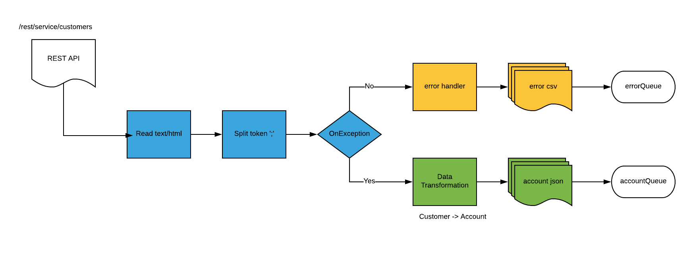

= Agile Integration Advanced LAB 3 - Fuse REST, Split and Transform Lab

A lab based on Springboot Camel to consume CSV records from a REST endpoint, split and transform to individual JSON output records to an AMQ queue.

[type=walkthroughResource,serviceName=openshift]
.OpenShift
****
* link:{openshift-host}[Openshift Console, window="_blank"]
****

[type=walkthroughResource]
.Useful Resources
****
* link:https://access.redhat.com/documentation/en-us/red_hat_fuse/7.2/html-single/tooling_user_guide/index[Red Hat Fuse Tooling Guide, window="_blank"]
****

[time=10]
== Introduction and Set up

In this lab, you modify the route from previous lab to read from a REST endpoint, instead of a file, and write the output to a message queue. The project is tested locally, and then deployed on OpenShift.

=== Goals

* Build an Apache Camel route that consumes CSV records from REST API and transforms the records into Java objects using the Bindy transformation component
* Split the list of received Java objects and apply a Java-to-Java transformation using the Red Hat Fuse Integration Editor (from `org.acme.Customer` to `org.globex.Account`)
* Map the fields as defined within the table
* Transform the `org.globex.Account` Java objects into individual JSON records
* Move the JSON record to a message broker Queue
* Implement the DLQ pattern to move erroneous CSV records into an error queue.
* Design a unit test to validate the data transformations

=== Usecase Diagram

=== Import the Project into Red Hat CodeReady Studio

. Open *Red Hat CodeReady Studio*.
.. Select *File -> Import* from the menu.
.. Select *Maven -> Existing Maven Projects* and click *Next*.
.. Click *Browse*, navigate to the directory containing the *rest-split-and-transform-amq-lab* project, and click *Open*.
.. In *Projects*, make sure the */pom.xml* box is checked for `com.redhat.gpte.training:>rest-split-transform-amq-lab:1.0.0:pom`:
.. Click *Finish*.

. The imported use case now appears in Red Hat CodeReady Studio.

[type=verification]
Did the project get imported correctly to your workspace?

[type=verificationFail]
Ensure the project pom is selected and there are no build errors on import.

[type=taskResource]
.Red Hat CodeReady Studio
****
* link:https://access.redhat.com/documentation/en-us/red_hat_developer_studio/12.9/[Red Hat CodeReady Studio Product Documentation, window="_blank"]
****

[time=60]
== Develop the Solution

=== Import the Camel Route

. Copy the Camel route you developed in the previous lab.
. Test to verify the route builds and works correctly.

=== Develop the Routing Module
. The Camel routes that need to be developed should implement the functionality shown in the graphic above.

* Replace the consumer from the File endpoint to a REST endpoint:
** Component: *Servlet*
** contextPath: */rest*
** path: */service*
** method: *POST*
** uri: */customers*
** to: *"direct:inbox"*
+
NOTE: We use a direct endpoint, so that the existing route can be changed to start from the same direct endpoint, in effect exposing the route through REST.

. Use the following endpoint definitions:
** Producer endpoint: `amqp:queue:accountQueue`
** Error endpoint: `amqp:queue:errorQueue`

. Change the 'split' processor to use the `*;*` tokenizer instead of `*\n*`.
. At the end of the route, provide a *transform* processor to provide a response message *Processed the customer data.*

[type=verification]
Is the camel route coding complete?

[type=taskResource]
.Development Resources
****
* link:http://camel.apache.org/exception-clause.html[Apache Camel Exception Clause, window="_blank"]
* link:http://camel.apache.org/file.html[Apache Camel File Component, window="_blank"]
* link:http://camel.apache.org/splitter.html[Apache Camel Splitter, window="_blank"]
* link:http://camel.apache.org/bindy.html[Apache Camel Bindy Component, window="_blank"]
* link:http://camel.apache.org/rest-dsl.html[Apache Camel REST DSL, window="_blank"]

****

[time=20]
== Verify your Solution

=== Prepare the AMQ Broker

. Start the Red Hat AMQ broker instance and make sure it has connectors for AMQP enabled, listening on port 5672.
. Open the AMQ Console at URL `http://localhost:8161`.
. Login to the AMQ console with credentials `admin` and `password`.
. Create the queues `accountQueue` and `errorQueue` as *AnyCast* queues.

=== Run the Camel Route 

. Build the project:
+
----
mvn clean install
----

. Run the project locally:
+
----
mvn spring-boot:run
----

. Once the Camel route is running, the REST service should be started. Look for the following message in the console:
+
----
Route: 32d64e54-9ae4-42d3-b175-9cfd81733379 started and consuming from: servlet:/service/customers?httpMethodRestrict=POST

----

. Send a curl request to the REST endpoint:
+
----
curl -k http://localhost:8080/rest/service/customers -X POST  -d 'Rotobots,NA,true,Bill,Smith,100 N Park Ave.,Phoenix,AZ,85017,602-555-1100;BikesBikesBikes,NA,true,George,Jungle,1101 Smith St.,Raleigh,NC,27519,919-555-0800;CloudyCloud,EU,true,Fred,Quicksand,202 Barney Blvd.,Rock City,MI,19728,313-555-1234;ErrorError,,,EU,true,Fred,Quicksand,202 Barney Blvd.,Rock City,MI,19728,313-555-1234' -H 'content-type: text/html'
----

. Check for any errors or exceptions in the Camel console.
. Check the broker web console. You should have 3 messages routed to the *accountQueue* and 1 message to the *errorQueue*.
. The curl message should receive a response as follows:
+
----
Processed the customer data.
----

. On the AMQ console, check that the `accountQueue` receives 3 JSON records, and `errorQueue` receives the error CSV record.

[type=verification]
Is the camel route starting correctly and running without errors?

[type=taskResource]
.Development Resources
****
* link:http://camel.apache.org/spring-testing.html[Apache Camel Spring Test Support, window="_blank"]
****

[time=45]
== Deploy and Run on OpenShift

=== Deploy to OpenShift

* In a terminal, login to your OCP instance by copying the login command from the OpenShift console.
. Use the namespace `{user-sanitized-username}-fuse`:
+
[subs="attributes"]
----
oc project {user-sanitized-username}-fuse
----

* Navigate to root folder of the  *rest-split-transform-amq-lab* project.
* Execute the following maven command:
+
----
mvn fabric8:deploy -Popenshift
----

* Check if your project is deployed successfully.
* Create a route to expose the service:
+
----
oc expose svc rest-split-transform-amq-lab
----

[type=verification]
Is the Fuse project deployed successfully on OpenShift?

=== Send Test Message

* Confirm the route URL for the application, and send a curl request to the REST endpoint:
+
----

curl -k http://`oc get route rest-split-transform-amq-lab -o template --template {{.spec.host}}`/rest/service/customers -X POST  -d 'Rotobots,NA,true,Bill,Smith,100 N Park Ave.,Phoenix,AZ,85017,602-555-1100;BikesBikesBikes,NA,true,George,Jungle,1101 Smith St.,Raleigh,NC,27519,919-555-0800;CloudyCloud,EU,true,Fred,Quicksand,202 Barney Blvd.,Rock City,MI,19728,313-555-1234;ErrorError,,,EU,true,Fred,Quicksand,202 Barney Blvd.,Rock City,MI,19728,313-555-1234' -H 'content-type: text/html'
----
+
NOTE: If the above command results in a *curl* error, you might have run into an issue with the charset encoding in your terminal. You can try the curl command from a broswer at `https://onlinecurl.com/` and this should work.

* Check pod logs for any errors or exceptions in the Camel route.
* Check the broker web console. You should have 3 messages to the *accountQueue* and 1 message to the *errorQueue*.
* The curl message should receive a response as follows:
+
----
Processed the customer data.
----

[type=verification]
Is the camel route running on Fuse on OpenShift working correctly?

