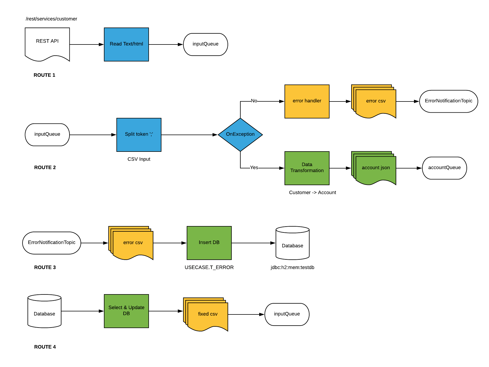

= Agile Integration Advanced LAB 4 - Fuse Fix Errors & Publish Records Lab

A lab based on Springboot Camel to consume records using REST into an input queue, process the records to a database, and provide DLQ pattern for fixing error records.

[type=walkthroughResource,serviceName=openshift]
.OpenShift
****
* link:{openshift-host}[Openshift Console, window="_blank"]
****

[type=walkthroughResource]
.Useful Resources
****
* link:https://access.redhat.com/documentation/en-us/red_hat_fuse/7.2/html-single/tooling_user_guide/index[Red Hat Fuse Tooling Guide, window="_blank"]
****

[time=10]
== Introduction and Set up

In this lab you modify the use case you developed in the *Split and Transform Rest* lab to publish the individual JSON `Account` records to message input queues, including an error topic in the event of a processing error. You also develop a strategy to correct erroneous messages and republish them.

The route implements an interception strategy when an `IllegalArgumentException` exception is thrown. The erroneous record is published to a special topic, and an error code and error message are added.

A separate route listens for error messages. When this route is triggered, the erroneous message and  message code are saved into an error table with the status of `ERROR`. To correct the record, you run a script against the error table and modify the status to `FIXED`. You use another route to poll the database for `FIXED` records. This route republishes the message on the original queue and updates the status to `CLOSED`.

=== Goals

* Publish records from the processing to an error topic
* Implement a custom error handling strategy to capture the erroneous messages
* Fix the messages and republish them

=== Usecase Diagram

=== Import the Project into Red Hat Developer Studio

. Open *Red Hat Developer Studio*.
.. Select *File -> Import* from the menu.
.. Select *Maven -> Existing Maven Projects* and click *Next*.
.. Click *Browse*, navigate to the directory containing the `03_rest-publish-and-fix-errors` project, and click *Open*.
.. In *Projects*, make sure the */pom.xml* box is checked for `com.redhat.gpte.training:>rest-publish-and-fix-errors-lab:1.0.0:pom`:
.. Click *Finish*.

. The imported use case now appears in Red Hat Developer Studio.

[type=verification]
Did the project get imported correctly to your workspace?

[type=verificationFail]
Ensure the project pom is selected and there are no build errors on import.

[type=taskResource]
.Red Hat Developer Studio
****
* link:https://access.redhat.com/documentation/en-us/red_hat_developer_studio/12.9/[Red Hat Developer Studio Product Documentation, window="_blank"]
****

[time=90]
== Develop the Solution

=== H2 Database

As part of this integration, you will be writing the records into a database. For the purposes of this lab, an embedded H2 database is provided to run the solution on the local host. You can find the configuration details in the `pom.xml` and `application-dev.properties` files.

An SQL script for creating the USECASE schema and the tables required is provided in the `schema.sql` file.

You can access the H2 console by opening the URL: link:http://localhost:8080/h2-console[http://localhost:8080/h2-console, window="_blank"]. Please enter the JDBC URL as `jdbc:h2:mem:testdb` and log in.

NOTE: The console will be available only after the routes are started. As the database is embedded, it does not persist data once the route is shutdown. 

=== Import the Camel Route

. Copy the Camel route you developed in the previous lab.
. Test to verify the route builds and works correctly.

=== Implement the Interception Strategy

. Develop your interception strategy to fetch the `IllegalArgumentException` exception and move the information into a `errorNotification` topic with the associated `error-code` and `error-message`.

* You can set the error code to `111` so that the error message corresponds to the first message reported by the stack trace that Camel Bindy throws.

* The string content of the message must be saved into the JMS message so it can be used to update the `T_ERROR` table.

[TIP]
====
* You can create a `direct:error` route that you call from your interception strategy.
* It is a good idea to add an EIP log processor to collect information using the `DEBUG` logging level and the `org.fuse.usecase` log name.
====

=== Extend the Existing Camel Routes

. Add a new route with an ActiveMQ endpoint to consume the JMS messages from the `errorNotification` topic.

. Develop your strategy to insert a record with the information from this route (code, error message, message, and status) into the `T_ERROR` table.

=== Redeliver the Corrected Message

. Based on the information saved into the `T_ERROR` database, develop your strategy to inject the corrected message into the `inputQueue` queue.

WARNING: Remember to update the status according to the values defined. A new message has the status `ERROR`, an updated message has the status `FIXED`, and a reinjected message has the status `CLOSED`.

[type=verification]
Is the camel route coding complete?

[type=taskResource]
.Development Resources
****
* link:http://camel.apache.org/exception-clause.html[Apache Camel Exception Clause, window="_blank"]
* link:http://camel.apache.org/file.html[Apache Camel File Component, window="_blank"]
* link:http://camel.apache.org/splitter.html[Apache Camel Splitter, window="_blank"]
* link:http://camel.apache.org/bindy.html[Apache Camel Bindy Component, window="_blank"]
* link:http://camel.apache.org/rest-dsl.html[Apache Camel REST DSL, window="_blank"]
* link:http://camel.apache.org/sql-component.html[Apache Camel SQL Component, window="_blank"]
* link:http://camel.apache.org/dead-letter-channel.html[Apache Camel DLQ Pattern, window="_blank"]

****

[time=20]
== Verify your Solution

=== Prepare the AMQ Broker

. Start the Red Hat AMQ broker instance and make sure it has connectors for AMQP enabled, listening on port 5672.
. Open the AMQ Console at URL `http://localhost:8161`.
. Login to the AMQ console with credentials `admin` and `password`.
. Create the queue `accountQueue`  as *AnyCast* queues if they are not created in previous lab.
. Create the topic `errorNotification` as *Anycast* topic.

=== Run the Camel Route 

. Build the project:
+
----
mvn clean install
----

. Run the project locally:
+
----
mvn spring-boot:run
----

. Once the Camel route is running, the REST service should be started. Look for the following message in the console:
+
----
Route: 32d64e54-9ae4-42d3-b175-9cfd81733379 started and consuming from: servlet:/service/customers?httpMethodRestrict=POST

----

. Send a curl request to the REST endpoint:
+
----
curl -k http://localhost:8080/rest/service/customers -X POST  -d 'Rotobots,NA,true,Bill,Smith,100 N Park Ave.,Phoenix,AZ,85017,602-555-1100;BikesBikesBikes,NA,true,George,Jungle,1101 Smith St.,Raleigh,NC,27519,919-555-0800;CloudyCloud,EU,true,Fred,Quicksand,202 Barney Blvd.,Rock City,MI,19728,313-555-1234;ErrorError,,,EU,true,Fred,Quicksand,202 Barney Blvd.,Rock City,MI,19728,313-555-1234' -H 'content-type: text/html'
----

. Check for any errors or exceptions in the Camel console.
. The curl message should receive a response as follows:
+
----
Processed the customer data.
----

. On the AMQ console, check that the destination `accountQueue` receives 3 JSON records, and `errorNotification` topic receives the error CSV record.
. Check the database table `T_ERROR` for error messages.
. Fix the error record by first checking the *ID* of the record:
+
----
UPDATE USECASE.T_ERROR SET MESSAGE='Error,EU,true,Fred,Quicksand,202 Barney Blvd.,Rock City,MI,19728,313-555-1234', STATUS='FIXED' WHERE ID=1;
----

. Check that the corrected record is picked up correctly by the camel route and processed.
. You should find this proccessed JSON record in the `accountQueue`.
. Check the database `T_ERROR` table to ensure the record is now marked as `CLOSED`.

[type=verification]
Is the camel route starting correctly and running without errors?

[type=taskResource]
.Development Resources
****
* link:http://camel.apache.org/spring-testing.html[Apache Camel Spring Test Support, window="_blank"]
****

[time=30]
== Deploy and Run on OpenShift

=== Deploy to OpenShift

* In a terminal, login to your OCP instance by copying the login command from the OpenShift console.
. Use the namespace `{user-sanitized-username}-fuse`:
+
[subs="attributes"]
----
oc project {user-sanitized-username}-fuse
----

* Navigate to root folder of the  *rest-publish-and-fix-errors-lab* project.
* Execute the following maven command:
+
----
mvn fabric8:deploy -Popenshift
----

* Check if your project is deployed successfully.
* Note the URL of the exposed service:
+
----
echo http://`oc get route rest-publish-and-fix-errors-lab -o template --template {{.spec.host}}`
----

[type=verification]
Is the Fuse project deployed successfully on OpenShift?

=== Send Test Message

* Confirm the route URL for the application, and send a curl request to the REST endpoint:
+
----

curl -k http://`oc get route rest-publish-and-fix-errors-lab -o template --template {{.spec.host}}`/rest/service/customers -X POST  -d 'Rotobots,NA,true,Bill,Smith,100 N Park Ave.,Phoenix,AZ,85017,602-555-1100;BikesBikesBikes,NA,true,George,Jungle,1101 Smith St.,Raleigh,NC,27519,919-555-0800;CloudyCloud,EU,true,Fred,Quicksand,202 Barney Blvd.,Rock City,MI,19728,313-555-1234;ErrorError,,,EU,true,Fred,Quicksand,202 Barney Blvd.,Rock City,MI,19728,313-555-1234' -H 'content-type: text/html'
----
+
NOTE: If the above command results in a *curl* error, you might have run into an issue with the charset encoding in your terminal. You can try the curl command from a broswer at `https://onlinecurl.com/` and this should work.

* Check pod logs for any errors or exceptions in the Camel route.
* Check the broker web console. You should have 3 messages to the *accountQueue* and 1 message to the *errorNotification*.
* The curl message should receive a response as follows:
+
----
Processed the customer data.
----

. Check the database table `T_ERROR` for error messages.
. Fix the error record by first checking the *ID* of the record:
+
----
UPDATE USECASE.T_ERROR SET MESSAGE='Error,EU,true,Fred,Quicksand,202 Barney Blvd.,Rock City,MI,19728,313-555-1234', STATUS='FIXED' WHERE ID=1;
----

. Check that the corrected record is picked up correctly by the camel route and processed.
. You should find this proccessed JSON record in the `accountQueue`.
. Check the database `T_ERROR` table to ensure the record is now marked as `CLOSED`.

[type=verification]
Is the camel route running on Fuse on OpenShift working correctly?

