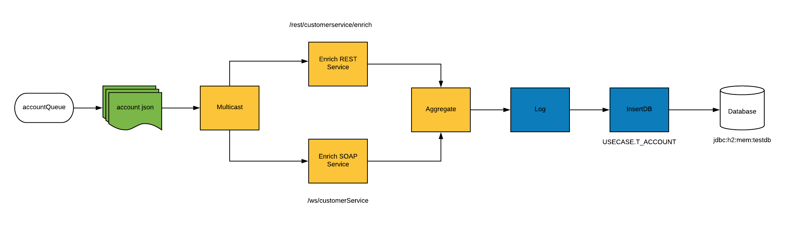

= Agile Integration Advanced LAB 5 - Fuse Enrich Content and Aggregate Data Lab

A lab based on Springboot Camel to process the account records in JSON format from AMQ, and through enrichment and aggregation create a more complete account record persisted in the database.

[type=walkthroughResource,serviceName=openshift]
.OpenShift
****
* link:{openshift-host}[Openshift Console, window="_blank"]
****

[type=walkthroughResource]
.Useful Resources
****
* link:https://access.redhat.com/documentation/en-us/red_hat_fuse/7.2/html-single/tooling_user_guide/index[Red Hat Fuse Tooling Guide, window="_blank"]
****

[time=10]
== Introduction and Set up

In this lab, you develop routes that process the account records in JSON format, and through enrichment and aggregation create a more complete account record. The resulting record is stored in a database.

=== Goals

* Design Apache Camel routes that consume JSON records from Red Hat AMQ
* Use the multicast EIP pattern to distribute the messages to the services
* Design the CXF web service using JAX-WS annotations to consume from SOAP backend service
* Consume from the backend REST service
* Aggregate the messages received using the aggregation EIP pattern
* Save the aggregated message in an SQL database using the Spring SQL component

=== Usecase Diagram

=== Import the Project into Red Hat CodeReady Studio

. Open *Red Hat CodeReady Studio*.
.. Select *File -> Import* from the menu.
.. Select *Maven -> Existing Maven Projects* and click *Next*.
.. Click *Browse*, navigate to the directory containing the `04_enrich-content-REST-and-WS-microservices`  project, and click *Open*.
.. In *Projects*, make sure the */pom.xml* box is checked for following 3 labs:
... `soap-cxfws-service`
... `rest-cxfrs-service`
... `amq-enrich-persist-lab`
.. Click *Finish*.

. The imported projects now appears in Red Hat CodeReady Studio.

[type=verification]
Did the projects get imported correctly to your workspace?

[type=verificationFail]
Ensure the project pom is selected and there are no build errors on import.

[type=taskResource]
.Red Hat CodeReady Studio
****
* link:https://access.redhat.com/documentation/en-us/red_hat_developer_studio/12.9/[Red Hat CodeReady Studio Product Documentation, window="_blank"]
****

[time=30]
== Prepare the Backend Services

=== REST Enrich Microservice

A REST microservice is used as a backend service for this solution. The REST service is provided in the project *rest-cxfrs-service*. 

==== Inspect the REST Service

The REST service enriches the Account record.

. It consists of the `CustomerRest` REST service with the following annotations:
+
----
@Path("/customerservice/")
public interface CustomerRest {

@POST @Path("/enrich") @Consumes("application/json")
Account enrich(Account customer);
----

* The implementation class contains logic to enrich the `Account` POJO as follows:
** Based on the `geo` field of the `company` object, a Java enumerator maps region codes to regions
** `{"NE,MW,SO,WE"}` corresponds to `{"NORTH_EAST,MIDWEST,SOUTH,WEST"}`
** The enriched `Account` object is returned by the `enrich()` method

* To expose the REST service within Spring, you use the CXF component's `rsServer` server. This is defined in the Application.java.

* Check the application.properties and notice the *cxf-path* and *server.port*.

==== Run the REST service

. To run the REST service locally, run the following Apache Maven command from the project's root folder:
+
----
mvn spring-boot:run -Dfabric8.skip
----

. The REST service should be running on port 8080, and can be accessed through URL: link:http://localhost:8080/rest/customerservice/enrich[http://localhost:8080/rest/customerservice/enrich]

. Try a sample request to the REST endpoint:
+
----
curl -k http://localhost:8080/rest/customerservice/enrich -X POST  -d '{"company":{"name":"Rotobots","geo":"NA","active":true},"contact":{"firstName":"Bill","lastName":"Smith","streetAddr":"100 N Park Ave.","city":"Phoenix","state":"AZ","zip":"85017","phone":"602-555-1100"}}' -H 'content-type: application/json'
----

. The response should be as follows:
+
----
{"clientId":0,"salesRepresentative":null,"company":{"name":"Rotobots","geo":"NORTH_AMERICA","active":true},"contact":{"firstName":"Bill","lastName":"Smith","streetAddr":"100 N Park Ave.","city":"Phoenix","state":"AZ","zip":"85017","phone":"602-555-1100"}}
----
+
NOTE: Notice that the content is enriched, and the GEO is replaced by the correct location.

==== Deploy to OpenShift Container Platform

* In a terminal, login to your OCP instance by copying the login command from the OpenShift console.
. Use the namespace `{user-sanitized-username}-fuse`:
+
[subs="attributes"]
----
oc project {user-sanitized-username}-fuse
----

* Navigate to root folder of the  *rest-cxfrs-service* project.
. To deploy the application to OpenShift Container Platform, execute the following maven command from the terminal:
+
----
mvn fabric8:deploy 
----

. Check that the project is deployed successfully. A pod for the deployment *rest-cxfrs-service* should be started. Notice the URL of the endpoint for external traffic.

. You can test the REST service by trying a curl request to the OpenShift route:
+
----
curl -k http://`oc get route rest-cxfrs-service -o template --template {{.spec.host}}`/rest/customerservice/enrich -X POST  -d '{"company":{"name":"Rotobots","geo":"NA","active":true},"contact":{"firstName":"Bill","lastName":"Smith","streetAddr":"100 N Park Ave.","city":"Phoenix","state":"AZ","zip":"85017","phone":"602-555-1100"}}' -H 'content-type: application/json'
----

. The response should be as follows:
+
----
{"clientId":0,"salesRepresentative":null,"company":{"name":"Rotobots","geo":"NORTH_AMERICA","active":true},"contact":{"firstName":"Bill","lastName":"Smith","streetAddr":"100 N Park Ave.","city":"Phoenix","state":"AZ","zip":"85017","phone":"602-555-1100"}}
----

=== SOAP Web Service 

A SOAP Web Service is provided as part of the assets for this lab. This service is developed using CXF-WS, and deployed on Apache Karaf. The service is running on Red Hat Fuse 6.3. This service is available in the project *soap-cxfws-service*.

==== Inspect the Solution

. A service is defined in the `CustomerWS` interface using the `@Webservice` annotation that exposes an operation to update the received `Account` object:
+
----
@WebService
public interface CustomerWS {

    CorporateAccount updateAccount(Account account);
----

. Based on the `Account` POJO received, it creates a `CorporateAccount` POJO containing the same fields as `Account`, plus these additional fields:

* `id`: (int) Set as a random value using 1 to 100 as the range
* `salesContact`: (String) Randomly populated using a list of contacts

. Uses the `updateAccount` method implemented within the `CustomerWSImpl` class to return `CorporateAccount`.

. Uses an Apache Camel CXF endpoint bean to configure the service and create it using these parameters:

* `id`: `customerWebService`
* `address`: `http://localhost:9090/ws/customerService`
* `serviceClass`: `org.fuse.usecase.service.CustomerWS`
* `loggingFeatureEnabled`: `true`

==== Run the SOAP service

. To run the SOAP service locally, run the following Maven command from the project root folder:
+
----
mvn camel:run -Dfabric8.skip
----

. The Camel service should be running on port 9090, and can be accessed through URL: link:http://localhost:9090/ws/customerService[http://localhost:9090/ws/customerService]

. You can try a sample request using the SOAP UI:
+
----
<soapenv:Envelope xmlns:soapenv="http://schemas.xmlsoap.org/soap/envelope/" xmlns:ser="http://service.usecase.fuse.org/">
   <soapenv:Header/>
   <soapenv:Body>
      <ser:updateAccount>
         <!--Optional:-->
         <arg0>
            <clientId>0</clientId>
            <!--Optional:-->
            <company>
               <active>true</active>
               <!--Optional:-->
               <geo>NA</geo>
               <!--Optional:-->
               <name>Bill Smith</name>
            </company>
            <!--Optional:-->
            <contact>
               <!--Optional:-->
               <city>Baltimore</city>
               <!--Optional:-->
               <firstName>Satya</firstName>
               <!--Optional:-->
               <lastName>Jayanti</lastName>
               <!--Optional:-->
               <phone>143-222-2344</phone>
               <!--Optional:-->
               <state>MD</state>
               <!--Optional:-->
               <streetAddr>1077 America Ave.</streetAddr>
               <!--Optional:-->
               <zip>11751</zip>
            </contact>
            <!--Optional:-->
            <salesRepresentative>?</salesRepresentative>
         </arg0>
      </ser:updateAccount>
   </soapenv:Body>
</soapenv:Envelope>
----

. The response should be as follows:
+
----
<soap:Envelope xmlns:soap="http://schemas.xmlsoap.org/soap/envelope/">
   <soap:Body>
      <ns2:updateAccountResponse xmlns:ns2="http://service.usecase.fuse.org/">
         <return>
            <company>
               <active>true</active>
               <geo>NA</geo>
               <name>Bill Smith</name>
            </company>
            <contact>
               <city>Baltimore</city>
               <firstName>Satya</firstName>
               <lastName>Jayanti</lastName>
               <phone>143-222-2344</phone>
               <state>MD</state>
               <streetAddr>1077 America Ave.</streetAddr>
               <zip>11751</zip>
            </contact>
            <id>44</id>
            <salesContact>Nandan Joshi</salesContact>
         </return>
      </ns2:updateAccountResponse>
   </soap:Body>
</soap:Envelope>
----
+
NOTE: Notice that the account is updated with the sales contact details.

==== Deploy to OpenShift Container Platform

. Change the cxf endpoint to port 8080, as this is the default HTTP port exposed in the OpenShift Karaf container.
. Notice the OpenShift YAML files provided for deployment, service, and route configuration.
. In a terminal, login to your OCP instance by copying the login command from the OpenShift console.
. Use the namespace `{user-sanitized-username}-fuse`:
+
[subs="attributes"]
----
oc project {user-sanitized-username}-fuse
----

. Navigate to root folder of the  *soap-cxfws-service* project.
. To deploy the application to OpenShift Container Platform, execute the following Maven command from the terminal:
+
----
mvn fabric8:deploy
----

. Check that the project is deployed successfully. A pod for the deployment *soap-cxfws-service* should be started. Notice the URL of the endpoint for external traffic.

. Determine the URL of the Web Service by using the following command:
+
----
echo http://`oc get route soap-service -o template --template {{.spec.host}}`/ws/customerService
----

. You can test the SOAP service by running the same SOAP UI request above, replacing the localhost URL with the remote URL. The response received should be the same as for localhost.

[time=90]
== Prepare the Solution

Now you will be implementing the Camel routes for enriching the Account data with the 2 backend services, aggregate the responses, and finally persist the data into a database table. You will be completing the code for this section in the project *amq-enrich-persist-lab*. 

=== H2 Database

As part of this integration, you will be writing the records into a database. For the purposes of this lab, an embedded H2 database is provided to run the solution on the local host. You can find the configuration details in the `pom.xml` and `application-dev.properties` files.

An SQL script for creating the USECASE schema and the tables required is provided in the `schema.sql` file.

You can access the H2 console by opening the URL: link:http://localhost:8080/h2-console[http://localhost:8080/h2-console, window="_blank"]. Please enter the JDBC URL as `jdbc:h2:mem:testdb` and log in.

NOTE: The console will be available only after the routes are started. As the database is embedded, it does not persist data once the route is shutdown. 

=== Develop the Integration

. Based on the usecase diagram provided, create a new route that consumes the JSON objects created in the previous lab. You can have your route start from the *accountQueue*.
. Set up the AMQP configuration and queues based on the previous lab.
. Convert the content to a string and unmarshall the JSON content to a POJO using the `<unmarshal>` processor.
* JSON library: `jackson`
* `unmarshalTypeName` attribute: `org.globex.Account`
* The result is used to multicast the exchange to the REST and web service endpoints.

. Do not multicast the exchange in parallel. To simplify the legibility of the code, use a direct endpoint (`callRestEndpoint`) to call the REST service and a different direct endpoint (`callWSEndpoint`) to call the web service service.

=== Define the REST Direct Routes

. To call the backend services, create two routes: one starting with `direct:callRestEndpoint` and the other with `direct:callWSEndpoint`.

* To correctly invoke the declared REST service, use an HTTP producer component and make sure the following `{header,value}` pairs are specified:

** `Content-Type=application/json`
** `Accept=application/json`
** `CamelHttpMethod=POST`
** `CamelCxfRsUsingHttpAPI=True`

=== Define the Web Service Direct Route

. Develop a direct web service route that starts with the `direct://callWSEndpoint` endpoint and calls the web service using the Camel CXF Producer.

=== Design the Aggregation Strategy

. From the results collected by the two services, aggregate the content in the `multicast` processor to reconcile the information received from the `CorporateAccount` POJO with the `Account` POJO.

* This new `Account` POJO contains the aggregated result that is sent to another Apache Camel route to insert the row into the database.
+
NOTE: The aggregation strategy must be developed within the `AccountAggregator` class.

=== Insert the Aggregated Data into the Database

Next you create a new Apache Camel route to insert the `Account` information into the `T_ACCOUNT` table of the `SAMPLEDB` database.

. Use the Spring SQL component and specify the SQL query to be used to insert the `Account` record within the `option` parameter of the SQL endpoint.
* Method: `defineNamedParameters(Account account)`

. Define the named parameters using a `Map<String, Object>` that you create within a bean that is called by the route to set the body, before calling the SQL endpoint.
* Bean: `ProcessorBean.class`

. After calling the SQL endpoint, add a log message processor to display the contents of the received body.

=== Develop a JUnit Test

. Develop a JUnit test case to validate that the `jackson` ObjectMapper can read the string content of the JSON `Account` message and generate an `Account` object.
* JUnit test class: `JacksonCompanyTest`

. Define two assert conditions: one to check that the object is not null, and the other to verify that the name of the company is equal to "Robocops".

[type=verification]
Is the camel route coding complete?

[type=taskResource]
.Development Resources
****
* link:http://camel.apache.org/rest-dsl.html[Apache Camel REST DSL, window="_blank"]
* link:http://camel.apache.org/sql-component.html[Apache Camel SQL Component, window="_blank"]
* link:https://camel.apache.org/cxf.html[Apache camel CXF Component, window="_blank"]
* link:https://camel.apache.org/multicast.html[Apache Camel Multicast, window="_blank"]
* link:http://camel.apache.org/amqp.html[Apache Camel AMQP Component, window="_blank"]

****

[time=20]
== Verify your Solution

=== Prepare the AMQ Broker

. Start the Red Hat AMQ broker instance and make sure it has connectors for AMQP enabled, listening on port 5672.
. Open the AMQ Console at URL `http://localhost:8161`.
. Login to the AMQ console with credentials `admin` and `password`.
. Check the messages in the `accountQueue`. You can use the messages generated from the previous lab.
. You can use the following JSON test messages to verify your solution:
.. Account 1:
+
----
{"company":{"name":"{Rotobots","geo":"NA","active":true},"contact":{"firstName":"Bill","lastName":"Smith","streetAddr":"100 N Park Ave.","city":"Phoenix","state":"AZ","zip":"85017","phone":"602-555-1100"}}
----

.. Account 2:
+
----
{"company":{"name":"BikesBikesBikes","geo":"NA","active":true},"contact":{"firstName":"George","lastName":"Jungle","streetAddr":"1101 Smith St.","city":"Raleigh","state":"NC","zip":"27519","phone":"919-555-0800"}}
----

.. Account 3:
+
----
{"company":{"name":"CloudyCloud","geo":"EU","active":true},"contact":{"firstName":"Fred","lastName":"Quicksand","streetAddr":"202 Barney Blvd.","city":"Rock City","state":"MI","zip":"19728","phone":"313-555-1234"}}
----

=== Run Backend REST And SOAP Services

. Ensure the *soap-cxfws-service* is running on port 9090, and can be accessed through URL: link:http://localhost:9090/ws/customerService[http://localhost:9090/ws/customerService]

. Ensure the *rest-cxfrs-service* is running on port 8080 and can be accessed through URL: link:http://localhost:8080/rest/customerservice/enrich[http://localhost:8080/rest/customerservice/enrich]

=== Run the Camel Route 

. Build the project:
+
----
mvn clean install
----

. Run the project locally:
+
----
mvn spring-boot:run -Dfabric8.skip
----

. Once the Camel route is running, the route should start listening for messages in the queue. You should see the following message in the log:
+
----
Route: _route3 started and consuming from: amqp://queue:accountQueue

----

. For each message in the `accountQueue`, you should see an output similar to following:
+
----
{CONTACT_STATE=NC, SALES_CONTACT=Guillaume Nodet, CREATION_USER=fuse_usecase, CREATION_DATE=2015-12-11 18:18:01.55, CONTACT_PHONE=600-555-7000, CONTACT_CITY=Raleigh, CONTACT_ADDRESS=1101 Smith St., COMPANY_NAME=MountainBikers, COMPANY_ACTIVE=true, CLIENT_ID=46, CONTACT_LAST_NAME=Jungle, CONTACT_ZIP=27519, COMPANY_GEO=SOUTH_AMERICA, CONTACT_FIRST_NAME=George}
----
+
NOTE: Expect to see differences for `CREATION_DATE`, `SALES_CONTACT`, and `CLIENT_ID` because they are generated values.

. Check the database to ensure the records are populated correctly in the T_ACCOUNT table.

[type=verification]
Is the camel route starting correctly and running without errors?

[type=taskResource]
.Development Resources
****
* link:http://camel.apache.org/spring-testing.html[Apache Camel Spring Test Support, window="_blank"]
****

[time=30]
== Deploy and Run on OpenShift

=== PostgreSQL Database

When we deploy the project to OpenShift Container Platform, we will use the PostgreSQL database and schema we set up earlier, instead of using the embedded H2 database. You can find the configuration details in the `application.properties` and `deployment.yml` files.

The schema and tables for the PostgreSQL database have already been created as part of the Environment Set up lab.

=== Deploy to OpenShift

* Change the `server.port` value in `application.properties` to 8080.
* In a terminal, login to your OCP instance by copying the login command from the OpenShift console.
* Use the namespace `{user-sanitized-username}-fuse`:
+
[subs="attributes"]
----
oc project {user-sanitized-username}-fuse
----

* Navigate to root folder of the  *rest-publish-and-fix-errors-lab* project.
* Execute the following maven command:
+
----
mvn fabric8:deploy -Popenshift
----

* Check if your project is deployed successfully.
* Check that the route runs successfully, consuming all 3 messages from accountQueue, and writing to the database.

[type=verification]
Is the Fuse project deployed successfully on OpenShift?

