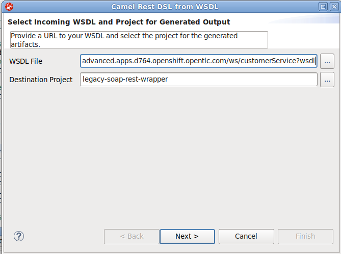
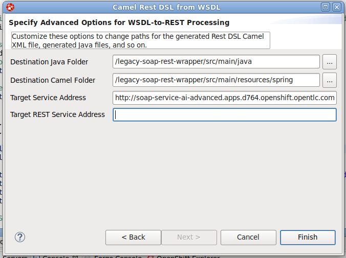
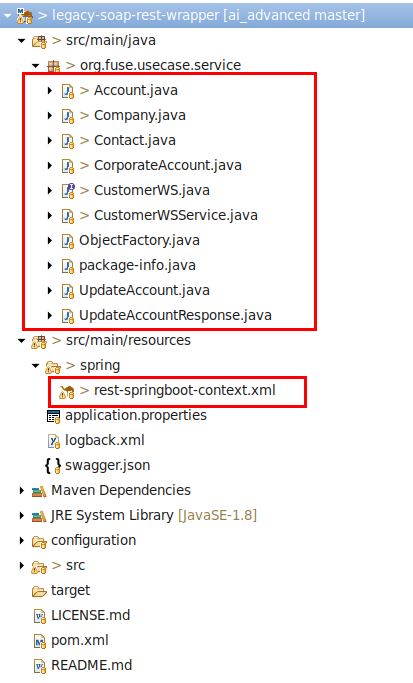

= Agile Integration Advanced LAB 6 - Fuse Migrate Fuse6 Services Lab

In this lab, you develop a Camel route to migrate legacy SOAP services to provide a REST API wrapper using Camel.

[type=walkthroughResource,serviceName=openshift]
.OpenShift
****
* link:{openshift-host}[Openshift Console, window="_blank"]
****

[type=walkthroughResource]
.Useful Resources
****
* link:https://access.redhat.com/documentation/en-us/red_hat_fuse/7.2/html-single/tooling_user_guide/index[Red Hat Fuse Tooling Guide, window="_blank"]
****

[time=10]
== Introduction and Set up

In this lab, you develop a Camel route to migrate legacy SOAP services to provide a REST API wrapper using Camel.

SOAP-based services are plentiful in many enterprise solutions and are slowly being replaced by RESTful services to simplify their use. A new wizard is available in the latest version of Red Hat Fuse Tooling to help you make the transition with Apache Camel’s Rest DSL. This lab shows how to use the new wizard to transition from older SOAP-based services to more modern REST-based services.

=== Goals

* Create REST API for the Customer SOAP service from previous lab.
* Design Apache Camel route that exposes REST API consuming JSON.
* Use the Red Hat Fuse Tooling in Red Hat Developer Studio to create *wsdl2rest* mapping.
* Deploy and test the solution.

=== Import the Project into Red Hat Developer Studio

. Open *Red Hat Developer Studio*.
.. Select *File -> Import* from the menu.
.. Select *Maven -> Existing Maven Projects* and click *Next*.
.. Click *Browse*, navigate to the directory containing the `05_migrate_fuse6`  project, and click *Open*.
.. In *Project* `legacy-soap-rest-wrapper`, make sure the */pom.xml* box is checked 
.. Click *Finish*.

. The imported projects now appears in Red Hat Developer Studio.

[type=verification]
Did the projects get imported correctly to your workspace?

[type=verificationFail]
Ensure the project pom is selected and there are no build errors on import.

[type=taskResource]
.Red Hat Developer Studio
****
* link:https://access.redhat.com/documentation/en-us/red_hat_developer_studio/12.9/[Red Hat Developer Studio Product Documentation, window="_blank"]
****

[time=30]
== Develop the Solution

=== SOAP Web Service 

The SOAP Web Service from the previous lab, available at *04_enrich-content-REST-and-WS-microservices/soap-cxfws-service*, is used as the backend SOAP service for this lab. This service is developed using CXF-WS, and deployed on Karaf. The service is running on Red Hat Fuse 6.3. 

. Determine the URL of the Web Service by using the following command:
+
----
echo http://`oc get route rest-cxfrs-service -o template --template {{.spec.host}}`/ws/customerService?wsdl
----

. Make a note of the URL above. You will use it to develop the camel route.

. You can test the SOAP service by running the same SOAP UI request above, replacing the localhost URL with the remote URL. The response received should be the same as for localhost.

=== Create the Camel Route

. Right-click the *legacy-soap-rest-wrapper* in the Red Hat Fuse Integration perspective and select *New->Camel Rest DSL from WSDL*, or click *File->New->Other…, Red Hat Fuse->Camel Rest DSL from WSDL*.
. Provide the URL to soap-cxfws-service WSDL and ensure the *legacy-soap-rest-wrapper* project is selected:
+

. Click *Next*.
. Keep the default values of fields unchanged and click *Finish*.
+

. Now you should see the Java classes and the Spring context XML *rest-springboot-context.xml*.
+

. Inspect the Camel route and notice that the solution is code-complete and ready to run.

==== Run the REST service

. To run the REST service locally, run the following Maven command from the project's root folder:
+
----
mvn spring-boot:run -Dfabric8.skip
----

. The Camel service should be running on port 808, and can be accessed through URL: link:http://localhost:8080/api/jaxrs/account[http://localhost:8080/api/jaxrs/account].
. Send a test request to the REST service and check if the backend service is invoked correctly:
+
----
$ curl -k http://localhost:8080/api/jaxrs/account -X PUT  -d '{"company":{"name":"Rotobots","geo":"NA","active":true},"contact":{"firstName":"Bill","lastName":"Smith","streetAddr":"100 N Park Ave.","city":"Phoenix","state":"AZ","zip":"85017","phone":"602-555-1100"}}' -H 'content-type: application/json'
----

. The response should be as below:
+
----
{"company":{"active":true,"geo":"NA","name":"Rotobots"},"contact":{"city":"Phoenix","firstName":"Bill","lastName":"Smith","phone":"602-555-1100","state":"AZ","streetAddr":"100 N Park Ave.","zip":"85017"},"id":33,"salesContact":"Bernard Tison"}
----

[type=verification]
Is the camel route working correctly?

[type=taskResource]
.Development Resources
****
* link:http://camel.apache.org/rest-dsl.html[Apache Camel REST DSL, window="_blank"]
* link:https://camel.apache.org/cxf.html[Apache camel CXF Component, window="_blank"]

****

[time=30]
== Deploy and Run on OpenShift

=== Deploy to OpenShift

* In a terminal, login to your OCP instance by copying the login command from the OpenShift console.
* Use the namespace `{user-sanitized-username}-fuse`:
+
[subs="attributes"]
----
oc project {user-sanitized-username}-fuse
----

* Navigate to root folder of the  *legacy-soap-rest-wrapper* project.

* Execute the following Maven command from the terminal:
+
----
mvn fabric8:deploy
----

* Check that the project is deployed successfully. A pod for the deployment *legacy-soap-rest-wrapper* should be started. 
* Notice the URL of the endpoint for external traffic.

* You can test the SOAP service by running the same SOAP UI request above, replacing the localhost URL with the remote URL. The response received should be the same as in localhost.

[type=verification]
Is the Fuse project deployed successfully on OpenShift?

