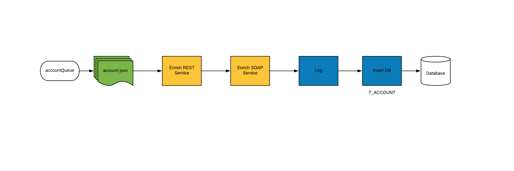
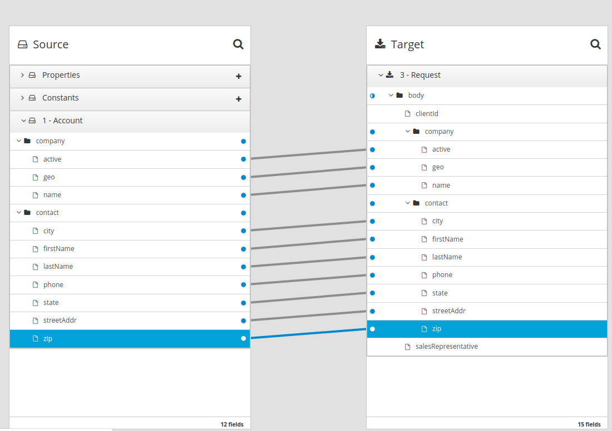
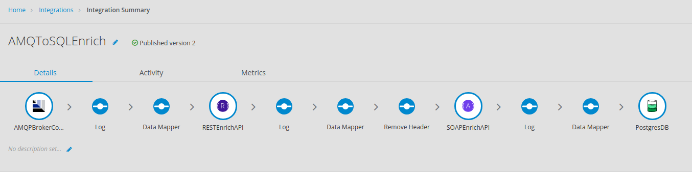

= Agile Integration Advanced LAB 7 - Fuse Online AMQ Enrich, Transform And Persist Lab

In this lab, you develop an integration in Red Hat Fuse Online that process the account records in JSON format, and through enrichment and aggregation create a more complete account record. The resulting record is stored in a database.

[type=walkthroughResource,serviceName=openshift]
.OpenShift
****
* link:{openshift-host}[Openshift Console, window="_blank"]

****

[type=walkthroughResource,serviceName=fuse]
.Fuse Online
****
* link:{fuse-url}[Fuse Online Console, window="_blank"]
****

[type=walkthroughResource]
.Useful Resources
****
* link:https://access.redhat.com/documentation/en-us/red_hat_fuse/7.2/html-single/integrating_applications_with_fuse_online/index[Red Hat Fuse Online Integrations, window="_blank"]
* link:https://access.redhat.com/documentation/en-us/red_hat_fuse/7.2/html-single/fuse_online_sample_integration_tutorials/index[Red Hat Fuse Online Tutorials, window="_blank"]
****

[time=10]
== Introduction and Set up

In this lab, you develop an integration in Red Hat Fuse Online that process the account records in JSON format, and through enrichment and aggregation create a more complete account record. The resulting record is stored in a database.

=== Goals

* Design Red Hat Fuse Online Integration that consumes JSON records from Red Hat AMQ
* Enrich using backend REST service
* Enrich using backend SOAP service using the REST wrapper
* Map the responses from backend services to data fields
* Save the aggregated message in an SQL database

=== Usecase Diagram

=== Login to Fuse Online

. Click on the link:{fuse-url} to open the `Fuse Online Console`.
. You should login with the following credentials:
.. *Username*: `{user-sanitized-username}@example.com`
.. *Password*: `Password1`

[type=verification]
Were you able to login to the Fuse Online Management Console?

[time=60]
== Develop the Solution

Develop the solution by creating a new `Integration` in the Red Hat Fuse Online console. Once the Integration is complete, you can `Publish` the integration to OpenShift and test the solution.

=== Extensions

A custom extension is required to manage the headers for the request to backend APIs. Hence, add the following extension: link:https://github.com/syndesisio/syndesis-extensions/tree/master/syndesis-extension-manage-headers[https://github.com/syndesisio/syndesis-extensions/tree/master/syndesis-extension-manage-headers].

The extension is available in the lab assets location in path `/code/fuse_online/extensions/syndesis-extension-manage-headers-1.0.0.jar`.

=== API Client Connectors

Create API connectors for the backend API services.

. Upload the REST API spec for the *REST CXFRS Service* Swagger specification using the URL below:
+
----
echo http://`oc get route rest-cxfrs-service -o template --template {{.spec.host}}`/rest/swagger.json
----

. Provide the following details:
.. *Connector Name*: Rest CXFRS Service
.. *Host*: `http://cxfrs-rest-service.{user-sanitized-username}-fuse:8080`
.. *Base URL*: /rest
+
. Upload the SOAP API specification for the *Legacy SOAP REST Wrapper* API JSON from the lab asset location: *fuse/05_migrate_fuse6/legacy-soap-rest-wrapper/src/main/resources/swagger.json*
* Provide the following details:
.. *Connector Name*: SOAP CXFWS Service
.. *Host*: `http://legacy-soap-rest-wrapper.{user-sanitized-username}-fuse:8080`
.. *Base URL*: /api

=== Connection

Set up the connections to following endpoints used for the integration:

==== *AMQP Message Broker* : Use the Red Hat AMQ broker deployed in the *{user-sanitized-username}-fuse* project with following details:

. *Connection URI*: amqp://broker-amq-amqp.{user-sanitized-username}-fuse:5672
. *User Name*: admin
. *Password*: password
. Retain the rest of the values as default and *validate* the connection.
. *Name*: AMQPBrokerConnection

==== *Database*: Use the PostgreSQL database deployed in the *{user-sanitized-username}* project with following details:

. *Connection URL*: jdbc:postgresql://postgresql.{user-sanitized-username}-fuse:5432/sampledb
. *Username*: postgres
. *Password*: postgres
. *Schema*: USECASE
. *Name*: UsecaseDB
+
NOTE: There is an intermittent issue in Red Hat Fuse Online which means the integration does not recognize the schema. If this issue occurs, move the T_ACCOUNT and T_ERROR tables to the `public` schema, and the integration should work. More details of the issue are available at: link:https://www.postgresql.org/docs/current/ddl-schemas.html#DDL-SCHEMAS-PUBLIC#[https://www.postgresql.org/docs/current/ddl-schemas.html#DDL-SCHEMAS-PUBLIC#].
+
IMPORTANT: The SQL commands for creating the tables in public schema are shown below:

. Connect to the PostgreSQL database pod using `rsh`, and login to the database.
. Create the tables in the `PUBLIC` schema:
+
----
CREATE TABLE T_ACCOUNT (
    id  SERIAL PRIMARY KEY,
    CLIENT_ID integer,
    SALES_CONTACT VARCHAR(30),
    COMPANY_NAME VARCHAR(50),
    COMPANY_GEO CHAR(20) ,
    COMPANY_ACTIVE BOOLEAN,
    CONTACT_FIRST_NAME VARCHAR(35),
    CONTACT_LAST_NAME VARCHAR(35),
    CONTACT_ADDRESS VARCHAR(255),
    CONTACT_CITY VARCHAR(40),
    CONTACT_STATE VARCHAR(40),
    CONTACT_ZIP VARCHAR(10),
    CONTACT_EMAIL VARCHAR(60),
    CONTACT_PHONE VARCHAR(35),
    CREATION_DATE TIMESTAMP,
    CREATION_USER VARCHAR(255)
);
CREATE TABLE T_ERROR (
    ID SERIAL PRIMARY KEY,
    ERROR_CODE VARCHAR(4) NOT NULL,
    ERROR_MESSAGE VARCHAR(255),
    MESSAGE VARCHAR(512),
    STATUS CHAR(6)
);
----

==== *Rest CXFRS Service*: set up the connection to the API client connector.

. *Authentication Type*: No security
. *Host*: `http://rest-cxfrs-service.{user-sanitized-username}-fuse:8080`
. *Base path*: /rest
. *Name*: RESTEnrichAPI

==== *SOAP CXFWS Service*: set up the connection to the API client connector.

. *Authentication Type*: No security
. *Host*: `http://legacy-soap-rest-wrapper.{user-sanitized-username}-fuse:8080`
. *Base path*: /api
. *Name*: SOAPEnrichAPI

=== Develop the Integration Module

Develop the Integration as per the usecase diagram. Use the following steps:

. Name the Integration *AMQToSQLEnrich*.

. Start Integration from *AMQPBrokerConnection*:
.. Subscribe for messages
.. *Destination*: accountQueue
.. *Destination Type*: Queue

. Select Output type:
.. *Select Type*:  JSON Instance
.. *Definition*: Paste the following:
+
----
{"company":{"name":"Rotobots","geo":"NA","active":true},"contact":{"firstName":"Bill","lastName":"Smith","streetAddr":"100 N Park Ave.","city":"Phoenix","state":"AZ","zip":"85017","phone":"602-555-1100"}}
----

.. *Data Type Name*: Account

. Choose Finish Connection *UsecaseDB*.
.. *Action*: Invoke SQL
.. *SQL Statement*: Paste the following:
+
----
INSERT INTO T_ACCOUNT(CLIENT_ID,SALES_CONTACT,COMPANY_NAME,COMPANY_GEO,COMPANY_ACTIVE,CONTACT_FIRST_NAME,CONTACT_LAST_NAME,CONTACT_ADDRESS,CONTACT_CITY,CONTACT_STATE,CONTACT_ZIP,CONTACT_PHONE,CREATION_DATE,CREATION_USER)                          VALUES                          (:#CLIENT_ID,:#SALES_CONTACT,:#COMPANY_NAME,:#COMPANY_GEO,:#COMPANY_ACTIVE,:#CONTACT_FIRST_NAME,:#CONTACT_LAST_NAME,:#CONTACT_ADDRESS,:#CONTACT_CITY,:#CONTACT_STATE,:#CONTACT_ZIP,:#CONTACT_PHONE,current_timestamp,:#CREATION_USER);

----

. Add Step *Log*.
.. Check *Message Body*
.. *Custom Text*: Input Message

. Add Connection *RestEnrichService*.
.. Choose Action *POST /customerservice/enrich*.

. Add *Data Mapping* before the *RestEnrichService* connection.
.. Map corresponding fields in input with the expected JSON request.
+

. Add Connection *SoapEnrichService*.
.. Choose Action *Enrich and Update a user account*.

. Add *Data Mapping* before the *SoapEnrichService* connection.
.. Map corresponding fields in input with the expected JSON request.

. Add a Step *Log* immediately after the *RestEnrichService*.
.. Check *Message Body*.
.. *Custom Text*: After REST Service.

. Add a Step *Remove Header* immediately after the *RestEnrichService*.
.. Enter Header *Transfer-Encoding*.
+
NOTE: The *Transfer-Encoding* header is added by Camel during the call to REST service. This header will cause errors if passed to the subsequent SOAP service. Hence, the header needs to be removed before the next API call.

. Add a Step *Log* immediately after the *SoapEnrichService*.
.. Check *Message Body*.
.. *Custom Text*: After SOAP Service.

. Add a *Data Mapping* step before the database connection.
.. Map the corresponding fields.
.. Enter a constant value *fuse_online* and map it to *CREATION_USER*.

Finally, the integration should look as follows:

 

[type=verification]
Is the Integration completed successfully?

[time=30]
== Test your Solution

=== Publish the Integration

. Once the integration is complete, save the integration and click on *Publish*.
. If the publish is successful, you should see the *i-amqtosqlenrich* pod running in the Fuse project.

[type=verification]
Is the Integration published successfully?

=== Test the Integration

. To test the integration, send a sample request to the *accountQueue*. You can use the *rest-split-transform-amq* application to send messages to *accountQueue*, or use the Red Hat AMQ Broker console as below:
+
image::images/amq-account-queue-send.png[diagram, role="integr8ly-img-responsive"]

. Below are 3 sample requests:
.. Account 1:
+
----
{"company":{"name":"Rotobots","geo":"NA","active":true},"contact":{"firstName":"Bill","lastName":"Smith","streetAddr":"100 N Park Ave.","city":"Phoenix","state":"AZ","zip":"85017","phone":"602-555-1100"}}
----

.. Account 2:
+
----

{"company":{"name":"BikesBikesBikes","geo":"NA","active":true},"contact":{"firstName":"George","lastName":"Jungle","streetAddr":"1101 Smith St.","city":"Raleigh","state":"NC","zip":"27519","phone":"919-555-0800"}}
----

. Account 3:
+
----
{"company":{"name":"CloudyCloud","geo":"EU","active":true},"contact":{"firstName":"Fred","lastName":"Quicksand","streetAddr":"202 Barney Blvd.","city":"Rock City","state":"MI","zip":"19728","phone":"313-555-1234"}}

----

. Check the *Activity* log in Red Hat Fuse Online console to verify that the integration has reported no errors.
+
image::images/fuse-online-activity-log.png[diagram, role="integr8ly-img-responsive"]

. Query the *T_ACCOUNT* table and ensure that the records are updated in the database:
+
----
sampledb=# select * from t_account;
----

. The response should be as follows:
+
----
 id | client_id | sales_contact | company_name |     company_geo      | company_active | contact_firs
t_name | contact_last_name | contact_address | contact_city | contact_state | contact_zip | contact_e
mail | contact_phone |       creation_date        | creation_user 
----+-----------+---------------+--------------+----------------------+----------------+-------------
-------+-------------------+-----------------+--------------+---------------+-------------+----------
-----+---------------+----------------------------+---------------
  1 |        91 | Kirk Hammett  | Rotobots     | NORTH_AMERICA        | t              | Bill        
       | Smith             | 100 N Park Ave. | Phoenix      | AZ            | 85017       |          
     | 602-555-1100  | 2019-01-07 14:53:55.059279 | fuse-online
(1 row)

----

