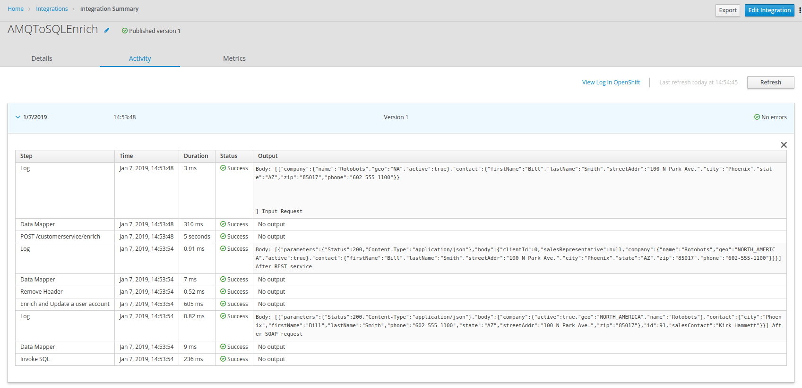

= Agile Integration Advanced LAB 8 - Fuse Online REST Enrich, Transform And Persist Lab

In this lab, you develop an integration in Red Hat Fuse Online that exposes a REST API to request & process the account records in JSON format, and through enrichment and aggregation create a more complete account record. The resulting record is stored in a database, and a success response is sent as the API response.

[type=walkthroughResource,serviceName=openshift]
.OpenShift
****
* link:{openshift-host}[Openshift Console, window="_blank"]

****

[type=walkthroughResource,serviceName=fuse]
.Fuse Online
****
* link:{fuse-url}[Fuse Online Console, window="_blank"]
****

[type=walkthroughResource]
.Useful Resources
****
* link:https://access.redhat.com/documentation/en-us/red_hat_fuse/7.2/html-single/integrating_applications_with_fuse_online/index[Red Hat Fuse Online Integrations, window="_blank"]
* link:https://access.redhat.com/documentation/en-us/red_hat_fuse/7.2/html-single/fuse_online_sample_integration_tutorials/index[Red Hat Fuse Online Tutorials, window="_blank"]
****

[time=10]
== Introduction and Set up

In this lab, you will extend the integration created in the previous lab in Red Hat Fuse Online, to expose it as a REST API. 

=== Goals

* Design Red Hat Fuse Online Integration that consumes JSON records from REST API
* Enrich using backend REST service
* Enrich using backend SOAP service using the REST wrapper
* Map the responses from backend services to data fields
* Save the aggregated message in an SQL database
* Send response to the API consumer

=== Usecase Diagram

image::images/rest_enrich_insert_fuse_online.png[diagram, role="integr8ly-img-responsive"]

=== Login to Fuse Online

. Click on the link:{fuse-url} to open the `Fuse Online Console`.
. You should login with the following credentials:
.. *Username*: `{user-sanitized-username}@example.com`
.. *Password*: `Password1`

[type=verification]
Were you able to login to the Fuse Online Management Console?

[time=60]
== Develop the Solution

Develop the solution by creating a new `Integration` in the Red Hat Fuse Online console. Once the Integration is complete, you can `Publish` the integration to OpenShift and test the solution.

=== Extensions

NOTE: This step is created in Lab 7. If you have completed it, please skip this section.

A custom extension is required to manage the headers for the request to backend APIs. Hence, add the following extension: link:https://github.com/syndesisio/syndesis-extensions/tree/master/syndesis-extension-manage-headers[https://github.com/syndesisio/syndesis-extensions/tree/master/syndesis-extension-manage-headers].

The extension is available in the lab assets location in path `/code/fuse_online/extensions/syndesis-extension-manage-headers-1.0.0.jar`.

=== API Client Connectors

NOTE: This step is created in Lab 7. If you have completed it, please skip this section.

Create API connectors for the backend API services.

. Upload the REST API spec for the *REST CXFRS Service* Swagger specification using the URL below:
+
----
echo http://`oc get route rest-cxfrs-service -o template --template {{.spec.host}}`/rest/swagger.json
----

. Provide the following details:
.. *Connector Name*: Rest CXFRS Service
.. *Host*: `http://cxfrs-rest-service.{user-sanitized-username}-fuse:8080`
.. *Base URL*: /rest
+
. Upload the SOAP API specification for the *Legacy SOAP REST Wrapper* API JSON from the lab asset location: *fuse/05_migrate_fuse6/legacy-soap-rest-wrapper/src/main/resources/swagger.json*
* Provide the following details:
.. *Connector Name*: SOAP CXFWS Service
.. *Host*: `http://legacy-soap-rest-wrapper.{user-sanitized-username}-fuse:8080`
.. *Base URL*: /api

=== Connection

NOTE: This step is created in Lab 7. If you have completed it, please skip this section.

Set up the connections to following endpoints used for the integration:

==== *AMQP Message Broker* : Use the Red Hat AMQ broker deployed in the *{user-sanitized-username}-fuse* project with following details:

. *Connection URI*: amqp://broker-amq-amqp.{user-sanitized-username}-fuse:5672
. *User Name*: admin
. *Password*: password
. Retain the rest of the values as default and *validate* the connection.
. *Name*: AMQPBrokerConnection

==== *Database*: Use the PostgreSQL database deployed in the *{user-sanitized-username}* project with following details:

. *Connection URL*: jdbc:postgresql://postgresql.{user-sanitized-username}-fuse:5432/sampledb
. *Username*: postgres
. *Password*: postgres
. *Schema*: USECASE
. *Name*: UsecaseDB
+
NOTE: There is an intermittent issue in Red Hat Fuse Online which means the integration does not recognize the schema. If this issue occurs, move the T_ACCOUNT and T_ERROR tables to the `public` schema, and the integration should work. More details of the issue are available at: link:https://www.postgresql.org/docs/current/ddl-schemas.html#DDL-SCHEMAS-PUBLIC#[https://www.postgresql.org/docs/current/ddl-schemas.html#DDL-SCHEMAS-PUBLIC#].
+
IMPORTANT: The SQL commands for creating the tables in public schema are shown below:

. Connect to the PostgreSQL database pod using `rsh`, and login to the database.
. Create the tables in the `PUBLIC` schema:
+
----
CREATE TABLE T_ACCOUNT (
    id  SERIAL PRIMARY KEY,
    CLIENT_ID integer,
    SALES_CONTACT VARCHAR(30),
    COMPANY_NAME VARCHAR(50),
    COMPANY_GEO CHAR(20) ,
    COMPANY_ACTIVE BOOLEAN,
    CONTACT_FIRST_NAME VARCHAR(35),
    CONTACT_LAST_NAME VARCHAR(35),
    CONTACT_ADDRESS VARCHAR(255),
    CONTACT_CITY VARCHAR(40),
    CONTACT_STATE VARCHAR(40),
    CONTACT_ZIP VARCHAR(10),
    CONTACT_EMAIL VARCHAR(60),
    CONTACT_PHONE VARCHAR(35),
    CREATION_DATE TIMESTAMP,
    CREATION_USER VARCHAR(255)
);
CREATE TABLE T_ERROR (
    ID SERIAL PRIMARY KEY,
    ERROR_CODE VARCHAR(4) NOT NULL,
    ERROR_MESSAGE VARCHAR(255),
    MESSAGE VARCHAR(512),
    STATUS CHAR(6)
);
----

==== *Rest CXFRS Service*: set up the connection to the API client connector.

. *Authentication Type*: No security
. *Host*: `http://rest-cxfrs-service.{user-sanitized-username}-fuse:8080`
. *Base path*: /rest
. *Name*: RESTEnrichAPI

==== *SOAP CXFWS Service*: set up the connection to the API client connector.

. *Authentication Type*: No security
. *Host*: `http://legacy-soap-rest-wrapper.{user-sanitized-username}-fuse:8080`
. *Base path*: /api
. *Name*: SOAPEnrichAPI

=== Develop the Integration Module

Develop the Integration as per the usecase diagram. Use the following steps:

. Name the Integration *APIToSQLEnrich*.

. Choose *API Provider* as the start connection.
. Choose to create from scratch.
. You should get an *Apicurito* design page now. Enter the following details:
.. *Name*: AccountUploadAPI
.. *Path*: /rest/account
.. *Operation*: PUT
.. *Data Type*: Account
.. *Data Type Example*: Copy the data below:
+
----
{"company":{"name":"Rotobots","geo":"NA","active":true},"contact":{"firstName":"Bill","lastName":"Smith","streetAddr":"100 N Park Ave.","city":"Phoenix","state":"AZ","zip":"85017","phone":"602-555-1100"}}
----

.. *PUT Summary*: Create Account Enrich and Upload record
.. *Consumes (inputs)*: application/json
.. *Produces (outputs)*: application/json
.. *Request Body Type*: Account
.. *Response*: 200 OK
.. *Response Type*: String
.. *Response Example*: Copy the data below:
+
----
{"result": "Account created successfully."}	

----

. The API should look like this:
+
image::images/apicurito-design-account-api.png[]

. Save the changes.
. Name the integration *APIToSQLEnrich*.
. Choose the *PUT* operation.
. Add the connections and steps as in the previous lab.
. Finally, add a Data Mapping step to respond to the API request.
+

The integration should look as follows:

image::images/rest_enrich_insert_integration.png[]

[type=verification]
Is the Integration completed successfully?

[time=30]
== Test your Solution

=== Publish the Integration

. Once the integration is complete, save the integration and click on *Publish*.
. If the publish is successful, you should see the *i-apitosqlenrich* pod running in the Fuse project.
. The URL to the API should be available from the integration page.
. You can access the REST API specification by opening the URL: <i-apitosqlenrich route>/openapi.json

[type=verification]
Is the Integration published successfully?

=== Test the Integration

. Send a *curl* request to the API:
+
----
curl -k <i-apitosqlenrich route>/rest/account -X PUT  -d '{"company":{"name":"Rotobots","geo":"NA","active":true},"contact":{"firstName":"Bill","lastName":"Smith","streetAddr":"100 N Park Ave.","city":"Phoenix","state":"AZ","zip":"85017","phone":"602-555-1100"}}' -H 'content-type: application/json'

----

. Below are 3 more sample requests:
.. Account 1:
+
----
{"company":{"name":"Rotobots","geo":"NA","active":true},"contact":{"firstName":"Bill","lastName":"Smith","streetAddr":"100 N Park Ave.","city":"Phoenix","state":"AZ","zip":"85017","phone":"602-555-1100"}}
----

.. Account 2:
+
----

{"company":{"name":"BikesBikesBikes","geo":"NA","active":true},"contact":{"firstName":"George","lastName":"Jungle","streetAddr":"1101 Smith St.","city":"Raleigh","state":"NC","zip":"27519","phone":"919-555-0800"}}
----

. Account 3:
+
----
{"company":{"name":"CloudyCloud","geo":"EU","active":true},"contact":{"firstName":"Fred","lastName":"Quicksand","streetAddr":"202 Barney Blvd.","city":"Rock City","state":"MI","zip":"19728","phone":"313-555-1234"}}

----

. Check the *Activity* log in Red Hat Fuse Online console to verify that the integration has reported no errors.
+

. Query the *T_ACCOUNT* table and ensure that the records are updated in the database:
+
----
sampledb=# select * from t_account;
----

. The response should be as follows:
+
----
 id | client_id | sales_contact | company_name |     company_geo      | company_active | contact_firs
t_name | contact_last_name | contact_address | contact_city | contact_state | contact_zip | contact_e
mail | contact_phone |       creation_date        | creation_user 
----+-----------+---------------+--------------+----------------------+----------------+-------------
-------+-------------------+-----------------+--------------+---------------+-------------+----------
-----+---------------+----------------------------+---------------
  1 |        91 | Kirk Hammett  | Rotobots     | NORTH_AMERICA        | t              | Bill        
       | Smith             | 100 N Park Ave. | Phoenix      | AZ            | 85017       |          
     | 602-555-1100  | 2019-01-07 14:53:55.059279 | fuse-online
(1 row)

----

. You should see a response as below for the REST API:
+
----
{"result": "Account created successfully."}	
----

