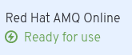
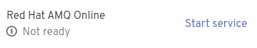
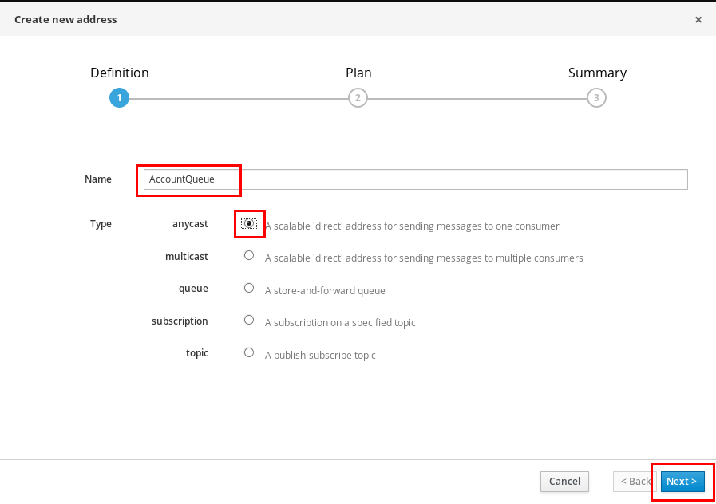
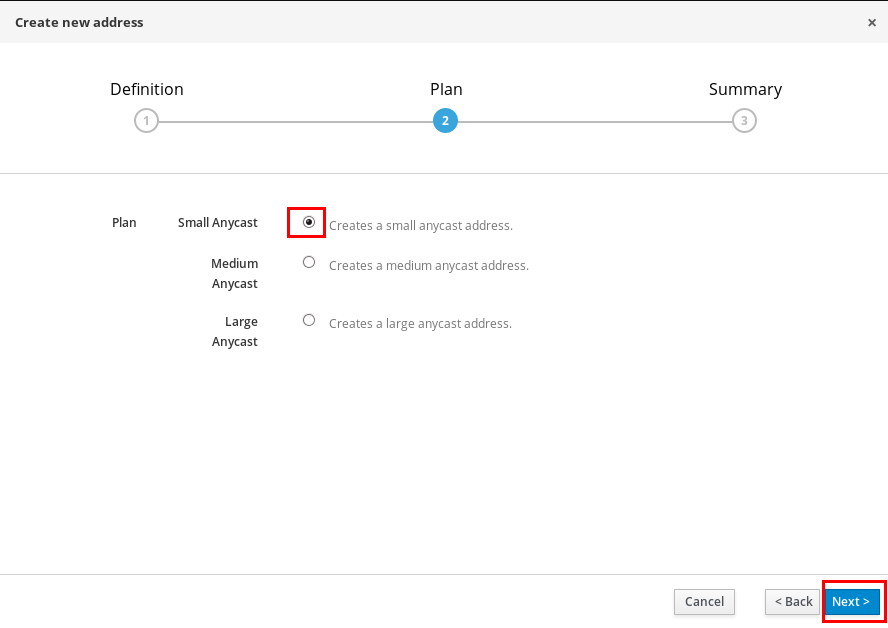
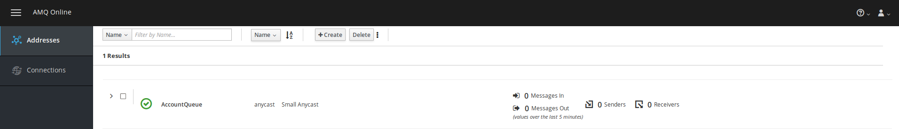
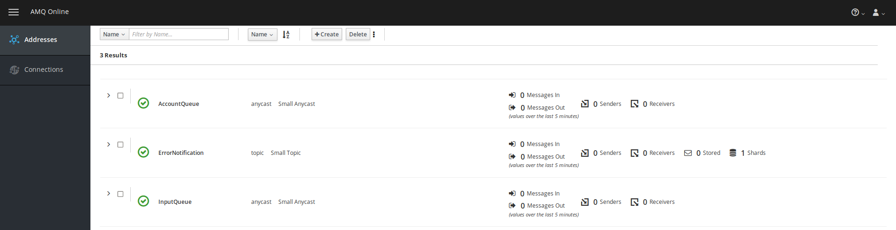

= Agile Integration Advanced LAB 10 - AMQ Online Setup Lab

In this lab, you set up AMQ Online to be used as the messaging platform on OpenShift for the Fuse and Fuse Online labs.

[type=walkthroughResource,serviceName=openshift]
.OpenShift
****
* link:{openshift-host}[Openshift Console, window="_blank"]

****

[type=walkthroughResource,serviceName=amq-online-standard]
.AMQ Online
****
* link:{enmasse-url}[AMQ Online Console, window="_blank"]
****

[type=walkthroughResource]
.Useful Resources
****
* link:https://access.redhat.com/documentation/en-us/red_hat_amq/7.2/html-single/using_amq_online_on_openshift_container_platform/index[Red Hat AMQ Online, window="_blank"]
* link:https://access.redhat.com/documentation/en-us/red_hat_amq/7.2/html-single/evaluating_amq_online_on_openshift_container_platform/index[Red Hat AMQ Online Evaluating for Production, window="_blank"]
****

[time=10]
== Introduction and Set up

In this lab, you will set up AMQ Online for use in the Fuse On OpenShift and Fuse Online labs. This will replace the standalone AMQ Broker used in the labs.

Red Hat AMQ Online is an OpenShift-based mechanism for delivering messaging as a managed service. With Red Hat AMQ Online, administrators can configure a cloud-native, multi-tenant messaging service either in the cloud or on premise. Developers can provision messaging using the AMQ Online console. Multiple development teams can provision the brokers and queues from the console, without requiring each team to install, configure, deploy, maintain, or patch any software.

For the current environment, your administrator has installed a single AMQ Online broker in the namespace `enmasse`. Each user will be a `tenant` in this installation, and will get provisioned a unique address space (with separate URL and credentials).

You can read more about AMQ Online setup and usecases by following the links on the right.

=== Goals

* Login to AMQ Console
* Create Queues and Topics
* Configure login credentials for AMQP
* Test the connection

=== Login to AMQ Online

. On the Solution Explorer page, ensure that the *Red Hat AMQ Online* application has a *Ready for use* status.
+

. Otherwise, click on the *Start Service* link, to start the application.
+

. Wait for the status to change from *Not ready* to *Ready for use*, before proceeding.

. Click on the link:{enmasse-url}[AMQ Online Console, window="_blank"] to open the `AMQ Online Console`.
. You should login with the following credentials:
.. *Username*: `{user-sanitized-username}`
.. *Password*: `openshift`

[type=verification]
Were you able to login to the AMQ Online Management Console?

[time=20]
== Develop the Solution

Create the `addresses` on the AMQ Online console, and get information about access.

=== Addresses

. In the AMQ Online Management Console, click on `Create`.
. Provide name of the address as `AccountQueue`.
. Choose type `Anycast`.
+

. Click on `Next`.
. Select plan `Small Anycast`.
+

. Click on `Next`.

. In the Summary page, click `Create`.
. You should see your queue in the `Addresses` section of the console.
+

. Repeat the above process to create the topic `ErrorNotification` and queue `InputQueue`.
. You should have all 3 addresses available in the console.
+

[type=verification]
Were you able to create to the AMQ Online addresses sucessfully using the Management Console?

[time=30]
== Test your Solution

=== Access to AMQP

The AMQ Online in this environment is set up to use your OpenShift credentials using Single Sign On. Hence, the connection to the AMQP endpoint is as follows:

. *Broker URL*: `{enmasse-broker-url}`
. *Broker Username*: `{enmasse-credentials-username}`
. *Broker Password*: `{enmasse-credentials-password}`

=== Update Fuse Project

. Open the project `03_rest-publish-and-fix-errors` in Red Hat CodeReady Studio.
. Open the file `application.properties`.
. Replace the `amqp.host`, `amqp.username` and `amqp.password` with the above credentials.
. Redeploy the application to OpenShift by running `mvn fabric8:deploy` from the project root folder.
. Send a test request and confirm that the messages are send correctly to the `InputQueue`, `AccountQueue` and `ErrorNotification` addresses successfully.

[type=verification]
Is the Fuse Integration running successfully with AMQ Online endpoint?

=== Update Fuse Online

Now you can change the *AMQP Connection* in the Fuse Online Integration to use the above broker credentials and verify your solution.

[type=verification]
Is the Fuse Online Integration running successfully with AMQ Online endpoint?
